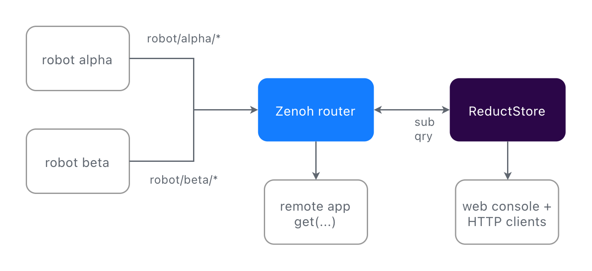
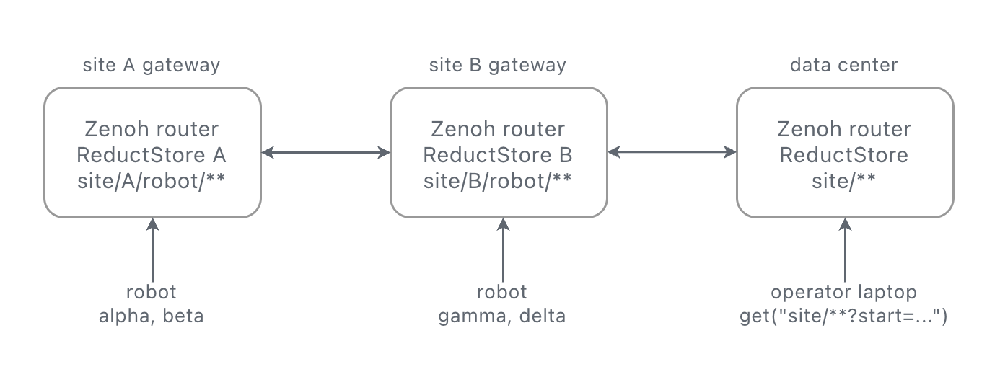
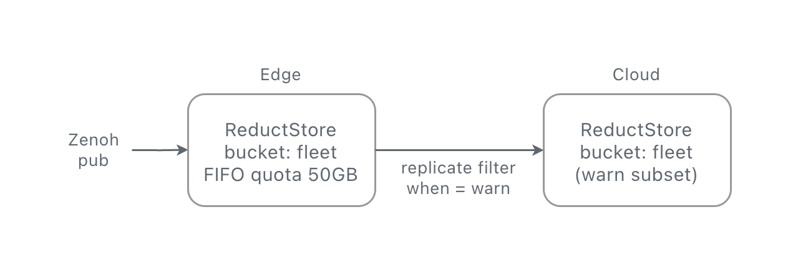
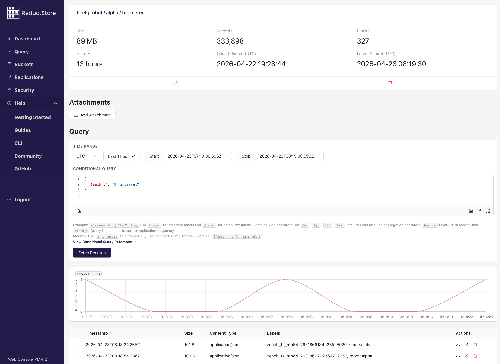

[ReductStore](https://www.reduct.store) is an open source time series
object store. It can persist time series data of any size and type:
small JSON telemetry, camera frames, LiDAR point clouds, vibration
chunks, or anything else you can encode as bytes. Starting with version 1.19,
it ships a native Zenoh plugin: an instance can join a Zenoh
network as a regular peer, subscribe to key expressions, persist
every sample it receives, and answer `get()` queries on the same key
space. No bridge process, no extra protocol.

The data models line up well. A Zenoh sample is published on a key
(e.g. `robot/arm/joint1`) and carries a timestamp, a payload, and an
optional attachment. On the storage side, a record is stored under an entry
name and carries a timestamp, an arbitrary size payload, and a set of
labels. Same structure, different taxonomy. The mapping between the
two is almost one to one:

| Zenoh sample | ReductStore record |
|--------------|--------------------| 
| Key          | Entry name         |
| Timestamp    | Timestamp          |
| Payload      | Payload            |
| Attachment   | Labels             |

Key expressions (wildcard patterns like `robot/**`) are used on the
ReductStore side to configure which keys the subscriber and queryable
respond to.

This post walks through a small runnable example (two simulated
robots, a gateway, one ReductStore instance, and a remote query
client) and highlights four patterns that work well together.
Everything is in
[github.com/reductstore/zenoh-example](https://github.com/reductstore/zenoh-example);
`docker compose up` and you can follow along.

## The setup



Each robot publishes to `robot/<id>/camera` (JPEGs at 2 Hz) and
`robot/<id>/telemetry` (JSON at 10 Hz). ReductStore connects to the
router as a Zenoh client and both subscribes and answers queries on
`robot/**`. The whole integration is environment variables:

```yaml
reductstore:
  image: reduct/store:latest  # v1.19+ has a native Zenoh API
  environment:
    RS_ZENOH_ENABLED: "true"
    RS_ZENOH_CONFIG: "mode=client;connect/endpoints=[tcp/zenoh-router:7447]"
    RS_ZENOH_BUCKET: "fleet"
    RS_ZENOH_SUB_KEYEXPRS: "robot/**"
    RS_ZENOH_QUERY_KEYEXPRS: "robot/**"
  ports:
    - "8383:8383"
```

Robots write the way they already do. The Zenoh attachment on a
sample becomes record labels on the ReductStore side:

```python
labels = {"robot": ROBOT_ID, "status": t["status"]}
pub.put(
    json.dumps(t).encode(),
    encoding=zenoh.Encoding.APPLICATION_JSON,
    attachment=json.dumps(labels).encode(),
)
```

## What you get

### 1. Query by time range and by condition

ReductStore hooks into Zenoh's `get()`. The selector carries a time
window, and a JSON attachment carries a condition on labels. Both are
evaluated on the storage side before any data is sent back to the client.

Time range:

```python
selector = f"robot/alpha/telemetry?start={start_us};stop={stop_us}"
replies = session.get(
    selector,
    consolidation=zenoh.ConsolidationMode.NONE,
)
```

Note the `ConsolidationMode.NONE`. Without it, Zenoh may
consolidate replies and return only one sample per key. For a time
series query you want every record in the range, so consolidation
must be disabled.

Conditional filter on labels:

```python
attachment = json.dumps({"when": {"&status": {"$eq": "warn"}}}).encode()
replies = session.get(
    f"robot/alpha/camera?start={start_us};stop={stop_us}",
    attachment=attachment,
    consolidation=zenoh.ConsolidationMode.NONE,
)
```

"Every camera frame from the last ten minutes where status was warn"
is one `get()`. No client side filtering. The `when` syntax supports
comparison, logical, arithmetic, and aggregation operators. See the
[Conditional Query Reference](https://www.reduct.store/docs/conditional-query)
for the full list.

### 2. Queries work over the network

Zenoh routes queries. A `get()` from a remote laptop does not need to
know where the storage lives; the router forwards it to whichever
peer answers for the key.

Same client code whether it runs next to the gateway or across the
WAN:

```bash
# on the gateway
python query_zenoh.py --robot alpha --last 60

# on a laptop somewhere else
python query_zenoh.py --robot alpha --last 60 \
    --endpoint tcp/gateway.example.com:7447
```

Storage can sit on the robot, on the gateway, or in the cloud. The
caller's code is the same in all three cases. Live data and
historical queries flow through the same Zenoh session.
`RS_ZENOH_QUERY_LOCALITY`
lets you restrict whether the storage answers local queries, remote
queries, or both.



### 3. FIFO quota policy based on storage volume

ReductStore buckets support a FIFO quota based on storage size: set a
limit, and the oldest blocks are dropped to make room for new ones.
This is more robust than a time-based retention policy for
edge devices. If a robot goes offline for days, a "keep the last 24
hours" rule would silently discard everything when the robot comes
back online. With a size-based policy, the bucket just fills up and keeps
the most recent 50 GB, regardless of how long that takes.

```yaml
# on the edge instance
environment:
  RS_BUCKET_1_NAME: "fleet"
  RS_BUCKET_1_QUOTA_TYPE: "FIFO"
  RS_BUCKET_1_QUOTA_SIZE: "50GB"
```

The bucket stays at 50 GB. `HARD` mode refuses new writes instead of
dropping old ones, if that is what you need.

### 4. Label based replication to the cloud

When ReductStore subscribes to data from a Zenoh router on the edge,
you may want to keep a long-term subset of that data in the cloud.
ReductStore can replicate records from one instance to another,
filtering by entry name and by label condition. The filter uses the
same Conditional Query syntax as `get()`, so you can match on labels 
but also on context (e.g. keep the last 10 seconds of data before and 
after a "warn" event).

```yaml
# on the edge instance: forward only warn events and their frames
environment:
  RS_REPLICATION_1_NAME: "warn_to_cloud"
  RS_REPLICATION_1_SRC_BUCKET: "fleet"
  RS_REPLICATION_1_DST_BUCKET: "fleet"
  RS_REPLICATION_1_DST_HOST: "https://reduct.example-cloud.com"
  RS_REPLICATION_1_DST_TOKEN: "${CLOUD_TOKEN}"
  RS_REPLICATION_1_ENTRIES: "robot/*/camera,robot/*/telemetry"
  RS_REPLICATION_1_WHEN: '{"&status": {"$eq": "warn"}}'
```

You label a record once, at ingest, and the same label drives the
read query, the retention policy, and the replication rule.



## Try it out

The full example is on GitHub. Clone, start the stack, and in a few
seconds you have two simulated robots publishing telemetry and camera
frames through a Zenoh router into ReductStore:

```bash
git clone https://github.com/reductstore/zenoh-example
cd zenoh-example
docker compose up --build
```

Once everything is up, open the ReductStore web console at
`http://localhost:8383` (API token: `reductstore`). You will see a
`fleet` bucket with entries for each robot's camera and telemetry
streams. You can browse records by time range, inspect labels, and
preview JPEG frames directly in the browser.



Now query the data over Zenoh from a separate terminal:

```bash
cd query && pip install -r requirements.txt

# latest 60 seconds of telemetry for robot alpha
python query_zenoh.py --robot alpha --last 60

# last 10 minutes, only records where status was "warn"
python query_zenoh.py --robot alpha --last 600 --only-warn
```

The query script connects to the Zenoh router, sends a `get()` with a
time range selector, and receives the matching records.

If you want to dig deeper, the [ReductStore + Zenoh integration
docs](https://www.reduct.store/docs/integrations/zenoh) cover every
configuration option, and the [replication
guide](https://www.reduct.store/docs/guides/data-replication) explains
label-based filtering in detail.

**-- The ReductStore Team**
