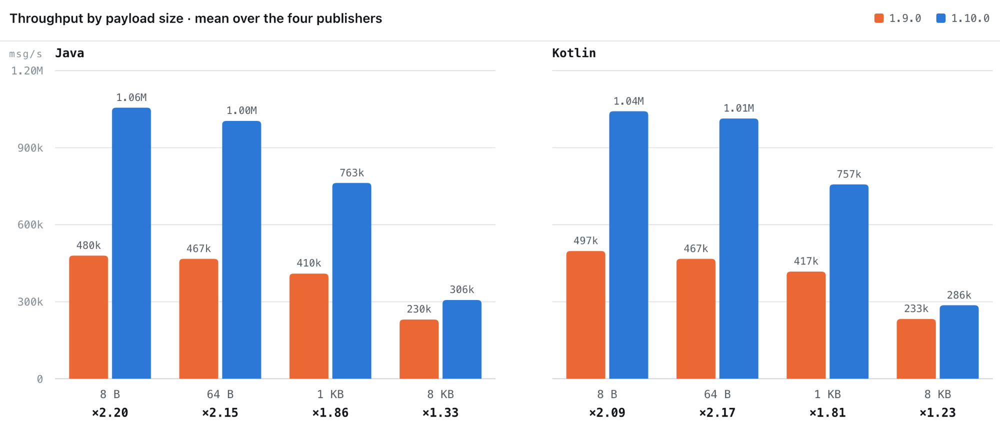

Zenoh 1.10.x **CODENAME** has landed!

<!-- TODO: intro paragraph -->

## Waitable transport SHM provider

Zenoh's transport shared-memory optimization uses a runtime-owned SHM provider. This provider is initialized **lazily and concurrently**: its creation can be triggered by the transport itself or when an application explicitly asks for it, which means that immediately after opening a session the provider may still be in the `Initializing` state rather than already being available.

Until now, applications that wanted to reuse this transport-managed provider had to deal with that asynchronous initialization themselves. A call could report that the provider was still initializing, leaving application code to retry later—typically introducing its own polling loop, sleep interval, or other synchronization logic. This was especially inconvenient in examples and applications that simply wanted to obtain the provider once and continue as soon as it became available. [This release](https://github.com/eclipse-zenoh/zenoh/pull/2610) addresses exactly this problem.

The provider state is now **waitable**. Internally, the `Initializing` state carries a receiver tied to the in-progress initialization. `ShmProviderState` implements both Zenoh's blocking `Wait` abstraction and Rust's `IntoFuture`, so applications can either synchronously wait for initialization or naturally `.await` it from asynchronous code. Waiting does not require repeatedly checking the state: the caller is resumed when initialization finishes. A ready provider is returned immediately, while disabled or failed initialization resolves without a provider.

This preserves the existing non-blocking behavior as well. Applications that care about observing the provider lifecycle can still distinguish `Disabled`, `Initializing`, `Ready`, and `Error`; applications that only need a usable provider can instead wait directly for the final result. The change therefore removes synchronization boilerplate without hiding the underlying state machine from applications that need finer control.

The same semantics are now available consistently from the **C and C++ APIs**. In zenoh-c, `z_obtain_shm_provider()` accepts a `blocking` argument. With blocking disabled, it immediately reports the current provider state as before; with blocking enabled, it waits until initialization either produces the provider or fails. The returned state still explicitly distinguishes disabled, initializing, ready, and error conditions.

Zenoh-cpp exposes this through `Session::obtain_shm_provider(bool blocking = false)`. The method returns either the `SharedShmProvider` or a `ShmProviderNotReadyState`, keeping the default non-blocking behavior while allowing applications that prefer straightforward synchronous startup code to request blocking behavior explicitly.

The result is a small API change with a useful architectural consequence: applications no longer need to duplicate Zenoh's internal initialization synchronization. Instead of polling a lazily-created transport resource from user code, they can synchronize directly with the operation that is already creating it. This makes transport SHM setup simpler, avoids arbitrary retry intervals, and keeps the Rust, C, and C++ APIs aligned around the same provider lifecycle model.

The transport-managed provider remains part of Zenoh's unstable shared-memory API and is available when both shared-memory support and the transport SHM optimization are enabled. Applications can therefore reuse the same provider that Zenoh maintains for its transport optimizations instead of necessarily creating and managing an independent SHM provider of their own.

## io_uring support

Zenoh can now take advantage of Linux `io_uring` for its transport receive path. Enabled through the optional `uring` Cargo feature, the new backend is entirely internal: applications keep using the same Zenoh APIs, endpoints, and configuration. Zenoh automatically selects `io_uring` for eligible unicast links and transparently falls back to the existing Tokio receive path when the backend cannot be initialized or a link cannot use it.

Under the hood, the implementation uses multishot receive operations together with provided buffer groups backed by a dedicated memory arena. Instead of repeatedly issuing individual receive operations and allocating intermediate buffers, Zenoh can keep receive operations armed and let completed data directly reference memory managed by the `io_uring` buffer pool. The arena and reclamation mechanism are designed to efficiently handle both ordinary traffic and large messages spanning multiple receive buffers.

But the optimization does not stop at the system-call boundary. Integrating `io_uring` into the Zenoh transport also provided an opportunity to improve how fragmented receive buffers are processed. Previously, data split across multiple receive buffers could require defragmentation into a new contiguous buffer before further processing. The new path is designed around Zenoh's scatter/gather `ZBuf` representation, allowing fragmented batches to remain composed of several slices and be decoded directly from them. As a result, large or fragmented messages can avoid an additional userspace copy during transport-level buffer defragmentation. This makes the improvement partly an `io_uring` optimization and partly a more efficient data path through the Zenoh transport itself.

The integration deliberately preserves Zenoh's existing transport architecture rather than introducing a separate `io_uring` transport stack. A shared reader reactor services receive operations, while backend selection happens automatically for individual links. In this release, `io_uring` accelerates eligible **unicast RX** paths only; the transmit path remains unchanged. Unconnected UDP also stays on the regular path because one socket can be shared by several peers and therefore cannot be directly associated with a single `RecvMulti` receive stream.

The performance results are encouraging. During development, benchmarks posted in the [PR discussion](https://github.com/eclipse-zenoh/zenoh/pull/2332) showed approximately **25–50% lower latency**, depending on the tested scenario, together with a **small improvement in messaging rate**. These measurements motivated an additional independent performance evaluation before the PR was merged.

That independent evaluation confirmed the latency improvement with a controlled comparison between the same PR build with and without the `uring` feature. For TCP loopback workloads, `io_uring` reduced round-trip latency by about **22% for 1 KiB messages** and **18% for 64 KiB messages**, both statistically significant. The 64-byte and 1 MiB cases also showed favorable point estimates of roughly 24% and 14%, although those differences were not statistically significant at the tested sample size.

Throughput remained broadly comparable between the standard and `io_uring` backends. Against the released-line baseline, measured message rates were around **2–5% higher**, while the feature-only comparison against the same PR build without `io_uring` was effectively neutral. This suggests that the principal benefit of the current implementation is **lower receive-path latency and fewer data-movement costs**, rather than a dramatic increase in maximum throughput.

The benefit also persists under load. In a publication-frequency sweep, `io_uring` reduced RTT by roughly **17% at 10 kHz**, before transport queueing and backpressure became the dominant source of latency. Close to and beyond saturation, the difference naturally becomes much smaller because the cost of the receive backend is no longer the primary bottleneck.

For Linux deployments where latency and efficient handling of fragmented or larger messages matter, the backend can be enabled simply by building Zenoh with the `uring` feature. No application or endpoint changes are required. As with any low-level I/O optimization, the exact gain depends on workload, message size, kernel, and hardware, but the results so far show that `io_uring` can significantly shorten Zenoh's receive path while fitting transparently into the existing transport architecture.


## Timestamp instrumentation for latency measurement

Measuring end-to-end latency in a Zenoh network has always been easy at the endpoints and hard everywhere in between. A ping-pong benchmark tells you how long a round trip took, but not *where* the time went: in the publishing application, on the first hop, in a router queue somewhere in the middle, or on the delivery path to the subscriber. Answering that question meant correlating logs across several nodes and hoping their clocks agreed.

This release introduces **timestamp instrumentation**: a message can now carry a **timestamp stack** that accumulates a record at each point it passes through. Three interception points are defined, covering the lifecycle of a message across the topology:

* `Send` — the message is about to leave the publishing or replying application.
* `Route` — the message is forwarded by an intermediate node, recorded once per router or peer on the path.
* `Receive` — the message is delivered to the subscribing or querying application.

Instrumentation is requested **per message**, by the node that originates it. You build a `TimestampInstrumentation` selecting the points you care about, and attach it to a `put`, `delete`, `get`, or `reply`—directly or through a `Publisher` or `Querier`. Intermediate nodes need no configuration of their own: the request travels with the message, and each node it crosses appends its record because the message asked for it. Messages that are not instrumented carry no extension at all, so the feature costs nothing when it is not in use.

On the receiving side, the collected records are read from the `Sample` or the `Query` in traversal order:

```rust
let instr = TimestampInstrumentationBuilder::new()
    .set_send(true)
    .set_route(true)
    .set_receive(true)
    .build()?;

publisher.put("payload").timestamp_instrumentation(instr).await?;

// ... on the subscriber side
if let Some(stack) = sample.timestamp_stack() {
    for record in stack.records() {
        println!("{:?} at {:?}", record.point(), record.timestamp());
    }
}
```

By default the records hold **UHLC** timestamps, Zenoh's hybrid logical clocks, which are already comparable across nodes. When that is not what you want—because you need to line the measurements up with an external tracing system, or with a hardware clock—a session can register a **custom timestamp callback** at `open()` time. The callback receives a `TimestampContext` carrying the Zenoh ID and the mode of the node taking the measurement, and returns arbitrary bytes that are stored in place of the UHLC timestamp. Each record reports through `is_custom()` which of the two it holds, so a consumer can handle a mixed path where only some nodes install a callback.

The same API is available from **Python**, where the instrumentation is passed as a `timestamp_instrumentation` keyword argument and the stack is read back from the sample:

```python
instr = zenoh.TimestampInstrumentationBuilder().set_send(True).set_receive(True).build()

pub.put("payload", timestamp_instrumentation=instr)

# ... on the subscriber side
stack = sample.timestamp_stack
if stack is not None:
    for record in stack.records:
        print(record.point, record.timestamp())
```

The custom callback is available there too, as the `timestamp_callback` argument of `zenoh.open()`.

One rough edge was smoothed out shortly after the initial implementation: deconstructing a `Sample` into its owned parts through `SampleFields` used to silently drop the timestamp stack, so records collected along the wire path vanished for anyone using that conversion. `SampleFields` now carries the field like the rest of the sample.

Timestamp instrumentation is part of Zenoh's **unstable** API and requires the `unstable` feature. Being a protocol extension, it is understood only by nodes running 1.10 or later; older nodes on the path simply forward the message without contributing a record.

## Source Info update (Breaking change)

The `AdvancedSubscriber` uses the `SourceInfo` (entity id and sample sequence number) for it's own tracking of missing samples. Setting the `SourceInfo` field there is in reality the no-op, so the `source_info` setter was removed from `AdvancedSubscriber`. Documentation for `SourceInfo` was updated.

## Configuration changes

### Retention period for the AdvancedSubscriber's RecoveryConfig

An `AdvancedSubscriber` with recovery enabled keeps per-publisher state to detect sample losses. That state used to live for the whole lifetime of the subscriber, slowly growing as new publishers were discovered.
`RecoveryConfig` now exposes a `retention_period` (1 hour by default): the state of a publisher from which nothing has been received for that long is garbage collected, along with its periodic query task. Publishers still reported as alive by the liveliness subscriber are never reclaimed. Note that once a source's state has been dropped, losses that happened while it was silent can no longer be detected: the subscriber simply resynchronizes on the next sample it receives from that publisher.

### Selecting the message types optimized by shared memory

Zenoh can transparently offload large message payloads to shared memory (SHM) on local links, avoiding costly copies for high-throughput pub/sub. Previously this "transport optimization" was all-or-nothing. This release adds a new `transport/shared_memory/transport_optimization/messages` setting that lets you pick exactly which message categories benefit from it. Any combination of `put`, `query`, and `reply` is supported.
This is handy when your traffic mixes bulk data with RPC-style exchanges: SHM promotion shines for large, streaming publications but adds little for small, one-shot service calls, where it only competes for the SHM pool. For example, messages: ["put"] keeps zero-copy for your data plane while sending queries and replies over the regular network path.
Note that this only governs the automatic promotion of regular payloads: buffers your application explicitly allocates in shared memory are always sent zero-copy when the peer supports it, regardless of this setting.

## Zenoh Python Debian package support

Installing Zenoh-Python system-wide has become awkward on recent Debian-based distributions. Since Ubuntu 24.04, the system Python interpreter is marked as an *externally managed environment* ([PEP 668](https://peps.python.org/pep-0668/)), so the `pip install eclipse-zenoh` command we have been recommending fails outright unless the user first creates a virtual environment or overrides the protection. That is perfectly reasonable for application development, but it gets in the way when Zenoh-Python is meant to be a system dependency—for instance a service started at boot, or a script shared between several users.

Zenoh-Python is now also released as a Debian package, `python3-eclipse-zenoh`, published in the same Eclipse Zenoh Debian repository as the router and the other components. Installation is a single `apt` command, with no virtual environment and no `--break-system-packages` flag involved:

```bash
$ sudo apt install python3-eclipse-zenoh
```

If the Zenoh repository is not yet configured on your machine, follow the [installation instructions](https://zenoh.io/docs/getting-started/installation/#ubuntu-or-any-debian) to add the Eclipse Zenoh public key and sources list entry first.

The packages are produced by the release workflow from the very same `manylinux` wheels that are uploaded to PyPI, so the binary you get through `apt` is exactly the one that has gone through our release pipeline—there is no separately maintained build. A conversion script unpacks the wheel into `/usr/lib/python3/dist-packages`, preserves the `.dist-info` metadata so that `importlib.metadata` and `pip list` keep reporting the package correctly, and derives the `libc6` dependency from the wheel's `manylinux` tag so that `apt` refuses to install a package that the system's glibc cannot support. The `.dist-info` directory is marked as `dpkg`-managed, which prevents `pip` from trying to uninstall files owned by the package manager.

Packages are built for **amd64**, **arm64**, **armhf** and **i386**, covering the usual server, desktop and embedded Linux targets.

## Zenoh-Java and Zenoh-Kotlin

Zenoh-Java and Zenoh-Kotlin have been fully reworked internally to reduce code duplication and minimize maintenance effort.

Before Zenoh 1.10.0, `zenoh-java` and `zenoh-kotlin` each carried their own JNI wrapper around the Rust Zenoh library. These wrappers were written by hand, and the same boilerplate was duplicated in both repositories.

Since 1.10.0, both `zenoh-java` and `zenoh-kotlin` are thin wrappers around a common `zenoh-flat-jni` package that contains the native code. That library is itself generated automatically with the [prebindgen](https://crates.io/crates/prebindgen) tool from the Rust library `zenoh-flat` — an annotated, FFI-friendly wrapper around the `zenoh` library.

Beyond code unification and boilerplate removal, the biggest win of this rework is performance. Throughput on small samples has *more than doubled*, thanks to a significant reduction in the number of expensive JNI calls. The old hand-written code built structures on the Rust side and made one JNI call per field. The code generated by [prebindgen-jni](https://crates.io/crates/prebindgen-jni) flattens complex structures, passes them to Java through a callback in a single JNI call, and then cheaply rebuilds the structure on the Java side.



Several minor but breaking API changes were introduced with this update:

* `Timestamp` is now a Zenoh type, and it exposes the id of the node that produced the timestamp. This piece of information was lost before.
* `SampleMiss` was renamed to `Miss` to match the Zenoh API.

And a few more updates:

* The accept-replies API was stabilized.
* The build now uses the [Gradle wrapper](https://docs.gradle.org/current/userguide/gradle_wrapper.html).

## Zenoh-Pico

### Improved connection establishment

Zenoh-Pico now makes session startup more resilient when configured listeners or peers are not immediately available. Applications can configure `z_open()` to retry failed listen and connect operations for a bounded period or indefinitely, instead of failing after a single attempt. Separate exit-on-failure settings allow applications to choose between strict startup requirements and best-effort connectivity.

Client-mode connect endpoints are treated as alternatives, allowing the session to open as soon as one connection succeeds. In peer mode, Zenoh-Pico can establish the session through either a configured listener or a successful outbound connection. Once the session has a primary transport, it can continue attempting connections to additional peers when partial connectivity is permitted.

The new behaviour is controlled by four configuration options:

* `Z_CONFIG_CONNECT_TIMEOUT_KEY` controls how long failed connection attempts are retried.
* `Z_CONFIG_CONNECT_EXIT_ON_FAILURE_KEY` controls whether failed connections cause `z_open()` to fail.
* `Z_CONFIG_LISTEN_TIMEOUT_KEY` controls how long opening the configured listener is retried.
* `Z_CONFIG_LISTEN_EXIT_ON_FAILURE_KEY` controls whether failure to open the listener causes `z_open()` to fail.

Timeouts are specified in milliseconds: `"0"` performs a single attempt, a positive value retries until the timeout expires, and `"-1"` retries indefinitely. The exit-on-failure options accept `"true"` or `"false"`.

For example, a peer can retry listen and connect operations for ten seconds while tolerating individual failures:

```c
z_owned_config_t config;
z_config_default(&config);

zp_config_insert(z_loan_mut(config), Z_CONFIG_LISTEN_TIMEOUT_KEY, "10000");
zp_config_insert(z_loan_mut(config), Z_CONFIG_LISTEN_EXIT_ON_FAILURE_KEY, "false");
zp_config_insert(z_loan_mut(config), Z_CONFIG_CONNECT_TIMEOUT_KEY, "10000");
zp_config_insert(z_loan_mut(config), Z_CONFIG_CONNECT_EXIT_ON_FAILURE_KEY, "false");

z_owned_session_t session;
z_result_t ret = z_open(&session, z_move(config), NULL);
```

A primary transport must still be established before `z_open()` can succeed. In particular, client mode always requires at least one configured connect endpoint to succeed.

These configuration options are currently available only when `Z_FEATURE_UNSTABLE_API` is enabled.

### Idle read task and pending work reporting

We added a new build-time configuration variable `Z_RUNTIME_IDLE_READ_TASK_SLEEP` (defaults to `0`) which allows putting zenoh-pico background read task to sleep for specified number of milliseconds, if it did not receive anything on the last read, instead of constantly staying awake and checking sockets. This change mostly presents interest in a single-threaded mode, in the case when transport rx buffers are populated manually: `zp_spin_once` can now report if zenoh-pico has any more pending work to do (like accept pending connection, send keep-alive or attempt to read the socket), or if spinning zenoh-pico executor is useless, until the transport rx buffer is refilled again.

## Changelogs

The full changelog for every Zenoh repository is available at the following links:

[Rust](https://github.com/eclipse-zenoh/zenoh/releases) | [C](https://github.com/eclipse-zenoh/zenoh-c/releases) | [C++](https://github.com/eclipse-zenoh/zenoh-cpp/releases) | [Python](https://github.com/eclipse-zenoh/zenoh-python/releases) | [Java](https://github.com/eclipse-zenoh/zenoh-java/releases) | [Kotlin](https://github.com/eclipse-zenoh/zenoh-kotlin/releases) | [TypeScript](https://github.com/eclipse-zenoh/zenoh-ts/releases) | [Pico](https://github.com/eclipse-zenoh/zenoh-pico/releases) | [DDS plugin](https://github.com/eclipse-zenoh/zenoh-plugin-dds/releases) | [ROS2 plugin](https://github.com/eclipse-zenoh/zenoh-plugin-ros2dds/releases) | [MQTT plugin](https://github.com/eclipse-zenoh/zenoh-plugin-mqtt/releases) | [WebServer plugin](https://github.com/eclipse-zenoh/zenoh-plugin-webserver/releases) | [Filesystem backend](https://github.com/eclipse-zenoh/zenoh-backend-filesystem/releases) | [RocksDB backend](https://github.com/eclipse-zenoh/zenoh-backend-rocksdb/releases) | [S3 backend](https://github.com/eclipse-zenoh/zenoh-backend-s3/releases) | [InfluxDB backend](https://github.com/eclipse-zenoh/zenoh-backend-influxdb/releases)

<!-- TODO: closing paragraphs wrapping up the release story. -->

As always, your feedback, contributions, and real-world deployment stories help shape the future of Zenoh. Join the conversation, share your experiences, and help us continue making Zenoh better for everyone.

You can reach us on [Zenoh's Discord server](https://discord.com/invite/vSDSpqnbkm)!

**– The Zenoh Team**
